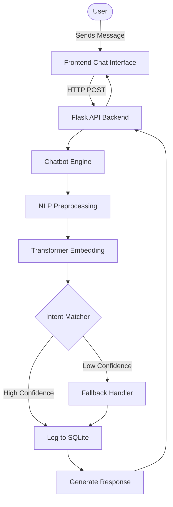

# 🤖 AI-Powered Customer Support Chatbot


An intelligent customer-support chatbot that uses Natural Language Processing (NLP) and Transformer-based semantic understanding to provide accurate, context-aware responses to customer queries.

## 1. Project Overview

This project implements a robust, AI-driven chatbot designed specifically for customer support scenarios. It leverages advanced Natural Language Processing to understand variations in user inputs, providing immediate and helpful assistance without the need for human intervention.

The chatbot aims to improve response times for common inquiries, such as tracking orders, refund policies, and business hours. By integrating a transformer-based model, it grasps the semantic meaning of sentences rather than just relying on simple keyword matching, ensuring a more natural and accurate conversation experience.

## 2. Features

- **Advanced NLP**: Intelligent text processing with tokenization, lemmatization, and stop-word removal.
- **Transformer Models**: Utilizes sentence-transformers for robust semantic matching of user queries.
- **Context Awareness**: Retains conversational context to provide more relevant responses.
- **Database Logging**: Uses SQLite to persist chat logs for analytics and future model training.
- **Web UI Integration**: Clean and responsive web interface served via Flask.
- **Configurable Intents**: Easily expandable JSON-based intent configuration.

## 3. Technologies Used

| Technology | Purpose | Version |
|------------|---------|---------|
| Python | Core programming language | 3.9+ |
| Flask | Web framework and API server | 3.1.1 |
| NLTK | Natural Language Toolkit for preprocessing | 3.9.1 |
| sentence-transformers | Generating semantic sentence embeddings | 3.4.1 |
| PyTorch | Deep learning backend for transformers | 2.0.0+ |
| SQLite | Lightweight relational database for chat logs | Built-in |

## 4. System Architecture



## 5. NLP Workflow

1. **Input**: Raw text from the user.
2. **Lowercase**: Conversion of all characters to lowercase for uniform processing.
3. **Remove Punctuation**: Stripping out special characters and punctuation marks.
4. **Tokenize**: Splitting the sentence into individual words (tokens).
5. **Lemmatize**: Reducing words to their base or dictionary form (e.g., "running" to "run").
6. **Remove Stopwords**: Filtering out common but less meaningful words (e.g., "the", "is", "at").
7. **Match**: Comparing the processed query against the configured intents to find the best response.

## 6. Transformer Model

The project utilizes the `all-MiniLM-L6-v2` transformer model via the `sentence-transformers` library. This model generates dense vector representations (sentence embeddings) of the user's query and the pre-defined intent patterns. 

By calculating the **cosine similarity** between the query's embedding and the patterns' embeddings, the system identifies the closest semantic match. If the similarity score falls below a specific threshold, a fallback mechanism is triggered, gracefully handling unknown inputs.

## 7. Database Structure

The SQLite database (`chatbot.db`) primarily stores chat logs.

| Column | Type | Description |
|--------|------|-------------|
| id | INTEGER | Primary Key, Auto-increment |
| user_query | TEXT | The raw input from the user |
| bot_response | TEXT | The response generated by the bot |
| intent | TEXT | The recognized intent tag |
| confidence | REAL | The confidence score of the match |
| timestamp | DATETIME | Time the interaction occurred |

## 8. Project Structure

```text
AI-Powered-Chatbot/
├── app.py                 # Main Flask application entry point
├── intents.json           # Configuration file for intents and responses
├── requirements.txt       # Python dependencies
├── .gitignore             # Git ignore rules
├── README.md              # Project documentation
├── static/                # Static assets (CSS, JS, Images)
├── templates/             # HTML templates for Flask
├── tests/                 # Unit and integration tests
│   └── test_chatbot.py    # Test suite for chatbot functionalities
├── nlp_processor.py       # Module handling NLTK text processing
├── chatbot.py             # Core logic for semantic matching
└── database.py            # SQLite database interactions
```

## 9. Installation

1. Clone the repository:
   ```bash
   git clone https://github.com/yourusername/AI-Powered-Chatbot.git
   cd AI-Powered-Chatbot
   ```
2. Create and activate a virtual environment:
   ```bash
   python -m venv venv
   # Windows:
   venv\Scripts\activate
   # macOS/Linux:
   source venv/bin/activate
   ```
3. Install dependencies:
   ```bash
   pip install -r requirements.txt
   ```
4. Download NLTK data:
   ```bash
   python -m nltk.downloader punkt wordnet stopwords
   ```
5. Initialize the database and run the app:
   ```bash
   python app.py
   ```

## 10. How to Run

After installation, start the Flask server by running:
```bash
python app.py
```
Open your web browser and navigate to `http://localhost:5000` to interact with the chatbot.

## 11. API Endpoints

| Method | Path | Description |
|--------|------|-------------|
| GET | `/` | Serves the main chat interface HTML |
| POST | `/chat` | Receives user messages and returns bot responses as JSON |
| GET | `/logs` | Returns a JSON payload of recent chat logs for admin review |

## 12. Example Questions

Users can ask various questions, including:
- "What are your business hours?"
- "How do I return a broken item?"
- "Where is my package right now?"
- "Can I pay using PayPal?"
- "I need to speak to a human about a complaint."

## 13. Screenshots


## 14. Future Enhancements

- **Multi-language Support**: Integrate translation models to handle queries in multiple languages.
- **Voice Integration**: Add Speech-to-Text and Text-to-Speech capabilities.
- **Continuous ML Training**: Automatically update embeddings and retrain models based on flagged incorrect responses.
- **User Authentication**: Allow users to log in to access personalized order information securely.
- **Analytics Dashboard**: A comprehensive admin dashboard to visualize query trends and bot performance.

## 15. Author

**[Meenakshi Bnasode]**  
*Internship Project 2026*

 
